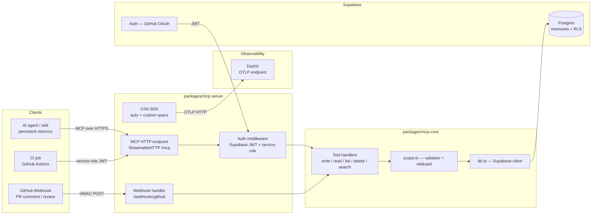

# Plan: lorekit — Supabase-backed MCP server for shared, persistent agent memory

## TL;DR

**What:** A new NX monorepo (`lorekit`) containing two packages — `packages/mcp-core` (tool handlers, DB client, scope validator) and `packages/mcp-server` (HTTP entry point, auth middleware, webhook handler) — backed by Supabase Postgres, with full OpenTelemetry instrumentation exporting traces, metrics, and logs to Dash0 via OTLP.
**Why:** Skill memory today lives in per-project files (`persist-memory` skill), which don't survive CI runs, can't be shared across machines or teammates, and can't be updated by external events like PR comment resolution.
**How:** NX workspace matching `gw-tools` conventions (`@nx/js`, `@nx/vite`, `@nx/vitest`, `@nx/eslint`, pnpm, `vitest.workspace.ts`); OTel auto-instrumentation for Node.js (`@opentelemetry/auto-instrumentations-node`) with custom spans on all five MCP tool handlers and the webhook handler; OTLP export to Dash0 via `OTEL_EXPORTER_OTLP_ENDPOINT` + `OTEL_EXPORTER_OTLP_HEADERS`.
**Done when:** A developer can point any `persistent-memory`-compatible skill at the server, read/write scoped lessons, and observe all MCP tool calls as traces and RED metrics in Dash0.

---

## Background & Context

The `persist-memory` skill from `mthines/agent-skills` currently stores lessons in flat Markdown files inside the project's `.claude/` directory. This design has three hard limits:

1. **CI is stateless** — file-based memory is lost after every CI run unless committed.
2. **No cross-machine sharing** — a lesson learned on one developer's laptop doesn't reach a colleague.
3. **No external update triggers** — no automatic way to capture PR comment resolution as a new lesson.

The proposed solution externalises memory into a database-backed MCP server. The NX monorepo structure matches `gw-tools` — the user's existing TypeScript monorepo — for immediate familiarity. OpenTelemetry instrumentation to Dash0 gives the server its own observability surface: which tools are called most, which scopes have the most lessons, error rates, latency percentiles — all visible in Dash0 without manual dashboarding.

---

## Requirements

1. **Persistent, database-backed memory** — lessons stored in Supabase Postgres, not on the filesystem. [user-stated]
2. **MCP server interface** — standard MCP server (official TypeScript SDK) so `persistent-memory`-compatible skills point at it with a one-line config change. [user-stated]
3. **Multi-scope memory** — four scopes with canonical `::` separator: `global`, `project::{name}`, `repo::{owner}/{name}`, `branch::{owner}/{name}::{branch}`. [user-stated]
4. **Cross-skill sharing** — one server instance serves any skill and any number of projects. [user-stated]
5. **CI compatibility** — GitHub Actions can authenticate with a service-role token. [user-stated]
6. **User authentication** — developers authenticate via Supabase Auth (GitHub OAuth); JWTs scope all DB operations. [user-stated]
7. **PR comment webhook** — handler for GitHub `pull_request_review_comment` and `pull_request_review` events; creates candidate memory entries tagged `source::pr-webhook`. [user-stated]
8. **Small, deployable application** — NX monorepo deployable to Supabase Edge Functions or Fly.io at low cost. [user-stated]
9. **`persistent-memory` skill compatibility** — MCP tool names and argument shapes are a superset of the `persist-memory` skill contract. [inferred]
10. **Row-level security** — users can read/write only their own rows or rows shared by their org. [inferred]
11. **NX monorepo matching `gw-tools`** — `@nx/js`, `@nx/vite`, `@nx/vitest`, `@nx/eslint` plugins; pnpm; `vitest.workspace.ts`; per-package `project.json`; `tsconfig.base.json` with path aliases. [user-stated]
12. **OpenTelemetry instrumentation to Dash0** — all three signals (traces, metrics, logs) exported to Dash0 via OTLP; custom spans on all MCP tool handlers and the webhook handler; resource attributes `service.name=lorekit`, `service.version`, `deployment.environment.name`; conformant with `otel-instrumentation` and `otel-semantic-conventions` (dash0hq/agent-skills). [user-stated]

### Out of Scope

1. Local filesystem fallback — callers retain their existing local skill.
2. Vector/semantic search — full-text + tag-based only in v1.
3. Multi-tenant SaaS billing — v1 is self-hosted or single-org.
4. Front-end dashboard — MCP interface is the only interface in v1.

---

## Decisions

| Decision | Alternatives Rejected | Rationale |
| -------- | --------------------- | --------- |
| NX monorepo matching `gw-tools` | Single package, Turborepo | User explicitly requested NX; `gw-tools` is the reference |
| Two packages: `mcp-core` + `mcp-server` | Single package | `mcp-core` is independently testable; `mcp-server` is the deployable entry |
| Supabase as backend | PlanetScale, Neon, raw Postgres | User already uses Supabase (`reaper-mcp`); provides Auth + RLS + Edge Functions |
| MCP TypeScript SDK | Custom HTTP JSON API | MCP SDK is what `persistent-memory` speaks; zero protocol translation |
| Streamable HTTP transport | stdio, WebSocket | Only transport that works over CI, remote machines, and Supabase Edge Functions |
| Supabase Auth (GitHub OAuth + service-role for CI) | Custom JWT | Native to the project; standard CI pattern |
| Row-level security in Postgres | Application-level filtering | RLS enforced at DB layer; immune to app bugs |
| `::` as scope segment separator | `/`, `:`, `-` | Avoids collision with `/` in repo paths and `:` in branch names |
| `@opentelemetry/auto-instrumentations-node` + custom spans | Manual-only instrumentation | Auto-instrumentation covers HTTP, Postgres, and Node.js runtime for free; custom spans add MCP-tool-level context |
| OTLP HTTP/protobuf to Dash0 | gRPC, console | Supabase Edge Functions support HTTP natively; Dash0 OTLP endpoint accepts `http/protobuf` |
| `AlwaysOn` sampler; sampling deferred to Dash0 pipeline | SDK-side `TraceIdRatioBased` | SDK-side sampling loses errors and slow requests; Dash0 handles sampling in the pipeline |

---

## Technical Approach

### Architecture Diagram



### OTel Instrumentation Design

Per the `otel-instrumentation` (dash0hq) and `otel-semantic-conventions` (dash0hq) skills:

**Resource attributes (set once at SDK init in `packages/mcp-server/src/instrumentation.ts`):**

| Attribute | Value |
| --------- | ----- |
| `service.name` | `lorekit` |
| `service.version` | from `package.json` |
| `deployment.environment.name` | from `DEPLOYMENT_ENV` env var (`production` / `staging`) |

**Span strategy — three tiers:**

| Tier | What | Kind | Span name |
| ---- | ---- | ---- | --------- |
| Auto-instrumented | HTTP server spans for all inbound requests | `SERVER` | `POST /mcp`, `POST /webhooks/github` — set by `@opentelemetry/instrumentation-http` |
| Auto-instrumented | Postgres queries via `@supabase/supabase-js` (uses `pg` under the hood) | `CLIENT` | `SELECT memories`, `INSERT memories` — set by `@opentelemetry/instrumentation-pg` |
| Custom (manual) | One span per MCP tool call | `INTERNAL` | `lorekit.memory.write`, `lorekit.memory.read`, `lorekit.memory.list`, `lorekit.memory.delete`, `lorekit.memory.search` |
| Custom (manual) | Webhook processing | `INTERNAL` | `lorekit.webhook.github` |

**Custom span attributes (applied to all `lorekit.*` spans):**

| Attribute | Type | Example |
| --------- | ---- | ------- |
| `lorekit.scope` | string | `repo::mthines/gw-tools` |
| `lorekit.scope.type` | string | `repo` (bounded: `global`, `project`, `repo`, `branch`) |
| `lorekit.tool.name` | string | `memory.write` |
| `lorekit.key` | string | `aw-lessons::worktree-conflict` |
| `lorekit.source_agent` | string | `aw-executor` (optional, from write payload) |
| `lorekit.trigger` | string | `stuck-loop` (optional, from write payload) |
| `lorekit.result.count` | int | 5 (for list/search results) |

**Important:** `lorekit.key` is not a high-cardinality risk — keys are bounded lesson identifiers. `lorekit.scope` is also bounded by the scope type set.

**Metrics (custom, via `@opentelemetry/api` MeterProvider):**

| Metric | Instrument | Unit | Attributes |
| ------ | ---------- | ---- | ---------- |
| `lorekit.tool.duration` | Histogram | `s` | `lorekit.tool.name`, `lorekit.scope.type`, `http.response.status_code` |
| `lorekit.memory.entries` | UpDownCounter | `1` | `lorekit.scope.type` (gauge of total entries, updated on write/delete) |
| `lorekit.webhook.received` | Counter | `1` | `lorekit.webhook.event` (`pr_comment`, `pr_review`), `lorekit.webhook.action` |

**Logs:** structured via `pino`; every log record includes `trace_id` and `span_id` from the active span context for correlation in Dash0. Exception details use `exception.type`, `exception.message`, `exception.stacktrace` attributes.

**Environment variables (add to `.env.example`):**

```bash
OTEL_SERVICE_NAME=lorekit
OTEL_TRACES_EXPORTER=otlp
OTEL_METRICS_EXPORTER=otlp
OTEL_LOGS_EXPORTER=otlp
OTEL_EXPORTER_OTLP_ENDPOINT=https://ingress.us-east-1.aws.dash0.com   # or your Dash0 region
OTEL_EXPORTER_OTLP_HEADERS=Authorization=Bearer <DASH0_AUTH_TOKEN>
OTEL_EXPORTER_OTLP_PROTOCOL=http/protobuf
OTEL_RESOURCE_ATTRIBUTES=deployment.environment.name=production
NODE_OPTIONS=--import @opentelemetry/auto-instrumentations-node/register
```

**Graceful shutdown:** `forceFlushAll()` on uncaught exception and unhandled rejection (see Node.js SDK rule) — critical for Supabase Edge Function cold-start/teardown.

### Patterns to Follow

- NX workspace config: follow `gw-tools/nx.json` exactly.
- Per-package structure: follow `gw-tools/packages/gw-tool/` — `project.json`, tsconfig chain, `vitest.config.ts`.
- OTel Node.js setup: follow `dash0hq/agent-skills:otel-instrumentation/rules/sdks/nodejs.md` — `--import` flag for ESM, `AlwaysOn` sampler, `forceFlushAll` on crash.
- Span naming: `{namespace}.{verb}` for custom spans (`lorekit.memory.write`), low-cardinality.
- Span status: `ERROR` only on final failure, always with a status message (error class + context).
- Exception logging: log record with `exception.*` attributes + `trace_id`/`span_id`, not `span.recordException()` (deprecated).
- Attribute naming: `lorekit.*` project namespace for custom attributes; standard semconv for HTTP/DB/messaging.

### Scope Format Specification (canonical)

| Scope type | Format | Example |
| ---------- | ------ | ------- |
| Global | `global` | `global` |
| Project | `project::{name}` | `project::agent-skills` |
| Repo | `repo::{owner}/{repo}` | `repo::mthines/gw-tools` |
| Branch | `branch::{owner}/{repo}::{branch}` | `branch::mthines/gw-tools::feat/add-memory` |

Rules:
1. `::` is the only valid segment separator. `:`, `/`, `-` as separators → `400 Bad Request`.
2. Segments are lowercased by the server.
3. Unknown scope prefixes are rejected before touching the DB.
4. `search` accepts `repo::mthines/*` as owner-level wildcard (expands to `LIKE 'repo::mthines/%'`).

### Edge Cases

| Edge Case | Handling |
| --------- | -------- |
| CI write conflicts with user lesson (same scope + key) | Last-write-wins on `updated_at`; `source` tag distinguishes CI vs user |
| Webhook fires for PR comment with no extractable lesson | Skip; log `lorekit.webhook.skipped` span event with `reason` attribute |
| Unauthenticated request | 401 JSON-RPC error `-32001`; span status `UNSET` (4xx on server span = server did its job) |
| Branch-scoped memory after branch deletion | Retained; callers prune via `delete` |
| Lesson body > 64 KB | `413` JSON-RPC error; span status `ERROR` with message `PayloadTooLargeError: value exceeds 65536 bytes` |
| Invalid scope string | `400` before any DB call; span event `scope.validation.failed` with `lorekit.scope` attribute |
| OTel exporter unreachable (Dash0 down) | SDK buffers and retries; server continues operating (OTel is non-blocking) |

### API / Interfaces

```typescript
// memory.write
{ scope: string, key: string, value: string, tags?: string[], source_agent?: string, trigger?: string }
// → { id: string, created_at: string }

// memory.read
{ scope: string, key: string }
// → { value: string, updated_at: string } | null

// memory.list
{ scope: string, tags?: string[], limit?: number }
// → { entries: Array<{ key: string, value: string, tags: string[], updated_at: string }> }

// memory.delete
{ scope: string, key: string }
// → { deleted: boolean }

// memory.search
{ q: string, scopes?: string[], tags?: string[], limit?: number }
// → { entries: Array<{ key: string, value: string, scope: string, tags: string[], rank: number }> }
```

Database schema:

```sql
create table memories (
  id          uuid primary key default gen_random_uuid(),
  user_id     uuid references auth.users,
  org_id      text,
  scope       text not null,
  key         text not null,
  value       text not null,
  tags        text[] not null default '{}',
  source_agent text,
  trigger     text,
  fts         tsvector generated always as (to_tsvector('english', key || ' ' || value)) stored,
  created_at  timestamptz not null default now(),
  updated_at  timestamptz not null default now(),
  constraint memories_user_scope_key_unique unique (user_id, scope, key)
);
create index memories_fts_idx on memories using gin(fts);
create index memories_scope_idx on memories(scope);
alter table memories enable row level security;
-- RLS policies: owner or same org_id can read; owner or service_role can write/update/delete
```

---

## Acceptance Criteria

- [ ] AC-1 (covers: R1, R2) — When a `persistent-memory`-compatible client sends `memory.write` over HTTPS with a valid JWT, the server shall persist the entry to Supabase Postgres and return the new record ID.
- [ ] AC-2 (covers: R2) — When a client calls `memory.read` with an existing canonical scope + key, the server shall return the stored `value` and `updated_at` without modification.
- [ ] AC-3 (covers: R3) — When entries are written with four canonical scopes, the server shall return each entry only for its exact scope; a non-canonical separator shall return `400`.
- [ ] AC-4 (covers: R4) — When two skills write different keys at the same scope, the server shall return both via `memory.list`.
- [ ] AC-5 (covers: R5) — When a GitHub Actions workflow authenticates with a service-role token, the server shall write the entry successfully.
- [ ] AC-6 (covers: R6) — When an unauthenticated request reaches `/mcp`, the server shall return JSON-RPC error `-32001` and HTTP 401.
- [ ] AC-7 (covers: R7) — When GitHub sends a valid HMAC-signed `pull_request_review_comment` event, the handler shall create a memory entry tagged `source::pr-webhook` under the repo's canonical scope.
- [ ] AC-8 (covers: R8) — When deployed to Supabase Edge Functions, cold-start shall complete within 2 seconds and `memory.list` shall respond under 500 ms for 1 000 rows.
- [ ] AC-9 (covers: R10) — When user A reads a memory entry owned by user B (no shared `org_id`), the server shall return `null`.
- [ ] AC-10 (covers: R3) — When `memory.search` is called with scope wildcard `repo::mthines/*`, the server shall return all matching entries ranked by full-text relevance.
- [ ] AC-11 (covers: R11) — `nx run-many -t typecheck,test,lint` shall pass with zero errors for both packages.
- [ ] AC-12 (covers: R12) — When `memory.write` is called, a `lorekit.memory.write` span shall appear in Dash0 with attributes `lorekit.scope`, `lorekit.scope.type`, `lorekit.key`, and span status `UNSET` on success or `ERROR` with a status message on failure.
- [ ] AC-13 (covers: R12) — The `lorekit.tool.duration` histogram shall be visible in Dash0 within 60 seconds of a tool call, with attribute `lorekit.tool.name` correctly set.
- [ ] AC-14 (covers: R12) — Log records emitted by the server shall include `trace_id` and `span_id` correlating to the active span, visible in Dash0 Logs Explorer.

---

## Implementation Order

1. **Scaffold NX workspace** — `nx.json` (copy from gw-tools), `package.json`, `tsconfig.base.json`, `vitest.workspace.ts`, `pnpm-workspace.yaml`, root `eslint.config.mjs`.
2. **Scaffold `packages/mcp-core`** — `project.json`, `package.json`, `tsconfig.json` + `tsconfig.lib.json` + `tsconfig.spec.json`, `vitest.config.ts`, `src/index.ts`.
3. **Scaffold `packages/mcp-server`** — same scaffold; add `dev` and `serve` targets to `project.json`.
4. **Create Supabase migration** — `supabase/migrations/00001_memories.sql`: `memories` table, FTS column, indexes, RLS policies.
5. **Implement `mcp-core/src/scope.ts`** — parse + validate canonical scope strings; reject unknown prefixes; expand `owner/*` wildcards; export `scopeType()` for telemetry attribute.
6. **Implement `mcp-core/src/db.ts`** — `createUserClient(jwt)` and `createServiceClient(serviceKey)` wrappers around `@supabase/supabase-js`.
7. **Implement `mcp-core` tool handlers** — `write.ts`, `read.ts`, `list.ts`, `delete.ts`, `search.ts`; each validates scope, enforces 64 KB limit, calls `db.ts`.
8. **Add OTel instrumentation setup** — `packages/mcp-server/src/instrumentation.ts`: initialise `@opentelemetry/auto-instrumentations-node` programmatically (needed for Supabase Edge Functions where `NODE_OPTIONS` env may not apply); set resource attributes; configure OTLP HTTP exporter; register `forceFlushAll` on `uncaughtException` / `unhandledRejection`. Must be the **first import** in `src/index.ts`.
9. **Instrument `mcp-core` tool handlers** — add `tracer.startActiveSpan('lorekit.memory.*')` wrappers; set `lorekit.*` span attributes from validated inputs; set span status per span rules (UNSET on success, ERROR with message on failure); emit `lorekit.tool.duration` histogram.
10. **Implement `mcp-server/src/auth.ts`** — JWT validation via `supabase.auth.getUser()`; service-role detection; reject unauthenticated with JSON-RPC `-32001`.
11. **Implement `mcp-server/src/server.ts`** — `McpServer` + `StreamableHTTPServerTransport`; register five tools from `mcp-core`; mount at `/mcp`.
12. **Implement `mcp-server/src/webhooks/github.ts`** — route `/webhooks/github`; HMAC-verify `x-hub-signature-256`; parse PR comment/review events; call `mcp-core` write handler with `source::pr-webhook` tag; wrap in `lorekit.webhook.github` span.
13. **Add structured logging** — `pino` logger in `mcp-server`; inject `trace_id`/`span_id` from `trace.getSpan(context.active())?.spanContext()` into every log record; use `exception.*` attribute pattern on errors.
14. **Write tests** — `mcp-core/src/scope.spec.ts` (unit), `mcp-core/src/tools/*.spec.ts` (integration against local Supabase), `mcp-server/src/auth.spec.ts`, `mcp-server/src/webhooks/github.spec.ts`; include OTel span assertions using `InMemorySpanExporter` (AC-12).
15. **Add CI workflow** — `.github/workflows/ci.yml`: pnpm install → `nx run-many -t typecheck,test,lint`; separate migration step on merge to `main`.
16. **Write `README.md`** — Supabase setup, env vars, Dash0 endpoint lookup, deploy command, `persistent-memory` config change.
17. **Write `CLAUDE.md`** — NX commands, package map, OTel env vars, Dash0 endpoint reference, key decisions.

---

## File Changes

| Action | File | Change | Reason |
| ------ | ---- | ------- | ------ |
| create | `nx.json` | NX plugins matching `gw-tools` | R11 |
| create | `package.json` | pnpm workspace root; `@nx/*` at `22.x`; pnpm `packageManager` | R11 |
| create | `tsconfig.base.json` | Root composite TS; `@lorekit/core` → `packages/mcp-core/src/index.ts` | R11 |
| create | `vitest.workspace.ts` | `defineWorkspace` pattern from `gw-tools` | R11 |
| create | `pnpm-workspace.yaml` | `packages: ["packages/*", "supabase/functions/*"]` | R11 |
| create | `eslint.config.mjs` | Flat ESLint config | R11 |
| create | `packages/mcp-core/project.json` | NX targets: typecheck, build, test, lint | R11 |
| create | `packages/mcp-core/package.json` | `name: "@lorekit/core"`, `type: "module"` | Package identity |
| create | `packages/mcp-core/tsconfig.json` + `tsconfig.lib.json` + `tsconfig.spec.json` | TS config chain | R11 |
| create | `packages/mcp-core/vitest.config.ts` | Vitest config | R11 |
| create | `packages/mcp-core/src/scope.ts` | Scope parser, validator, wildcard expander, `scopeType()` | R3, AC-3, AC-10 |
| create | `packages/mcp-core/src/db.ts` | Supabase client wrappers | R1 |
| create | `packages/mcp-core/src/tools/write.ts` | `memory.write` + `lorekit.memory.write` span | R1, AC-12 |
| create | `packages/mcp-core/src/tools/read.ts` | `memory.read` + span | R2 |
| create | `packages/mcp-core/src/tools/list.ts` | `memory.list` + span | R3, R4 |
| create | `packages/mcp-core/src/tools/delete.ts` | `memory.delete` + span | R2 |
| create | `packages/mcp-core/src/tools/search.ts` | `memory.search` + FTS + owner wildcard + span | R4, AC-10 |
| create | `packages/mcp-core/src/telemetry.ts` | Shared tracer + meter getters (`getTracer('lorekit')`, `getMeter('lorekit')`); `lorekit.tool.duration` histogram | R12 |
| create | `packages/mcp-core/src/index.ts` | Barrel export | Package API |
| create | `packages/mcp-core/src/scope.spec.ts` | Unit tests: valid scopes, invalid separators, wildcards | AC-3, AC-10 |
| create | `packages/mcp-core/src/tools/write.spec.ts` | Integration: write + OTel span assertion | AC-1, AC-12 |
| create | `packages/mcp-core/src/tools/read.spec.ts` | Integration: read | AC-2 |
| create | `packages/mcp-core/src/tools/list.spec.ts` | Integration: scope isolation, cross-skill | AC-3, AC-4 |
| create | `packages/mcp-core/src/tools/search.spec.ts` | Integration: FTS + wildcard | AC-10 |
| create | `packages/mcp-server/project.json` | NX targets + serve target | R11 |
| create | `packages/mcp-server/package.json` | `name: "@lorekit/server"`, `type: "module"` | Package identity |
| create | `packages/mcp-server/tsconfig.json` + `tsconfig.lib.json` + `tsconfig.spec.json` | TS config chain | R11 |
| create | `packages/mcp-server/vitest.config.ts` | Vitest config | R11 |
| create | `packages/mcp-server/src/instrumentation.ts` | OTel SDK init: resource attrs, OTLP HTTP exporter, `forceFlushAll`; must be first import | R12, AC-12 |
| create | `packages/mcp-server/src/logger.ts` | pino logger with `trace_id`/`span_id` injection | R12, AC-14 |
| create | `packages/mcp-server/src/auth.ts` | JWT + service-role middleware | R6, AC-6 |
| create | `packages/mcp-server/src/server.ts` | `McpServer` + `StreamableHTTPServerTransport`, `/mcp` route | R2 |
| create | `packages/mcp-server/src/webhooks/github.ts` | HMAC verify + PR event handler + `lorekit.webhook.github` span | R7, AC-7 |
| create | `packages/mcp-server/src/index.ts` | HTTP entry; first line: `import './instrumentation.js'` | R8 |
| create | `packages/mcp-server/src/auth.spec.ts` | Auth middleware tests | AC-5, AC-6, AC-9 |
| create | `packages/mcp-server/src/webhooks/github.spec.ts` | Webhook tests + span assertions | AC-7 |
| create | `packages/mcp-server/src/telemetry.spec.ts` | OTel span shape tests using `InMemorySpanExporter` | AC-12, AC-13 |
| create | `supabase/migrations/00001_memories.sql` | `memories` table + indexes + RLS | R1, R10 |
| create | `supabase/functions/mcp/index.ts` | Edge Function wrapper | R8 |
| create | `.github/workflows/ci.yml` | `nx run-many -t typecheck,test,lint` | R5, AC-11 |
| create | `README.md` | Setup, Dash0 endpoint lookup, deploy, `persistent-memory` config | R8, R12 |
| create | `CLAUDE.md` | NX commands, OTel env vars, Dash0 endpoint, key decisions | DX |
| create | `.env.example` | All env vars incl. OTEL_* and Dash0 endpoint | R12 |

---

## Existing Code Survey

| Planned new unit | Searched for | Closest existing match | Verdict | Rationale |
| ---------------- | ------------ | ---------------------- | ------- | --------- |
| `packages/mcp-core` NX package | NX TypeScript packages in mthines repos | `gw-tools/packages/gw-tool` — exact structural match | WRAP | Copy `project.json` + tsconfig chain skeleton; swap source content |
| `packages/mcp-server` NX package | NX server packages in mthines repos | `gw-tools/packages/vscode-gw` — similar skeleton | WRAP | Same config shape; different runtime target |
| `src/instrumentation.ts` OTel init | OTel setup in mthines repos | None found | BUILD NEW | No existing OTel instrumentation in accessible repos |
| `src/scope.ts` validator | Scope parsing in mthines repos | None | BUILD NEW | Novel to this project |
| `src/server.ts` MCP HTTP server | `McpServer` + HTTP in mthines repos | `reaper-mcp` — stdio only | BUILD NEW | HTTP transport is a different setup |
| `src/auth.ts` JWT middleware | Supabase auth in mthines repos | None in accessible repos | BUILD NEW | No existing auth middleware |
| `src/tools/*.ts` handlers | `memory.write` server-side in mthines repos | `persistent-memory` SKILL.md (client contract only) | BUILD NEW | Server-side implementation is new |
| `src/webhooks/github.ts` | HMAC webhook in mthines repos | None | BUILD NEW | No existing webhook handler |

---

## Tests

| Type | Test Case | File | Validates |
| ---- | --------- | ---- | --------- |
| unit | Valid canonical scope strings parse without error | `scope.spec.ts` | AC-3 |
| unit | Non-canonical separator (`:`) returns 400 | `scope.spec.ts` | AC-3 |
| unit | Owner wildcard `repo::mthines/*` expands to LIKE pattern | `scope.spec.ts` | AC-10 |
| integration | `memory.write` stores entry, returns id | `write.spec.ts` | AC-1 |
| integration | `memory.write` emits `lorekit.memory.write` span with correct attributes | `write.spec.ts` | AC-12 |
| integration | `memory.read` returns stored value | `read.spec.ts` | AC-2 |
| integration | Four distinct scopes return only exact-match entries | `list.spec.ts` | AC-3 |
| integration | Two skills' keys both visible in `memory.list` | `list.spec.ts` | AC-4 |
| integration | Service-role token accepted | `auth.spec.ts` | AC-5 |
| integration | No-auth returns 401 JSON-RPC `-32001` | `auth.spec.ts` | AC-6 |
| integration | Cross-user read returns null | `auth.spec.ts` | AC-9 |
| unit | Webhook HMAC mismatch rejects request | `github.spec.ts` | AC-7 |
| unit | PR comment event creates memory entry tagged `source::pr-webhook` | `github.spec.ts` | AC-7 |
| unit | `lorekit.webhook.github` span emitted on webhook receipt | `github.spec.ts` | AC-12 |
| integration | `memory.search` owner wildcard returns ranked results | `search.spec.ts` | AC-10 |
| unit | `lorekit.tool.duration` histogram recorded on every tool call | `telemetry.spec.ts` | AC-13 |
| unit | Log records include `trace_id` + `span_id` from active span | `telemetry.spec.ts` | AC-14 |
| nx | `nx run-many -t typecheck,test,lint --all` passes | CI | AC-11 |
| e2e (manual) | Deploy to Supabase Edge Functions; cold-start < 2s; list < 500ms at 1 000 rows | README smoke | AC-8 |

---

## Dependencies

| Package | Version | Scope | Role |
| ------- | ------- | ----- | ---- |
| `nx` | `22.4.0` [new] | root dev | Monorepo task runner (matches gw-tools) |
| `@nx/js` | `22.4.0` [new] | root dev | TS plugin |
| `@nx/vite` | `22.4.0` [new] | root dev | Vite/Vitest plugin |
| `@nx/vitest` | `22.4.0` [new] | root dev | Vitest target |
| `@nx/eslint` | `22.4.0` [new] | root dev | ESLint plugin |
| `@nx/eslint-plugin` | `22.4.0` [new] | root dev | NX lint rules |
| `pnpm` | `10.x` [new] | root | Package manager |
| `typescript` | `~5.9.x` [new] | root dev | Matches gw-tools |
| `vitest` | `4.x` [new] | root dev | Matches gw-tools |
| `eslint` | `~8.57.x` [new] | root dev | Matches gw-tools |
| `@modelcontextprotocol/sdk` | `^1.0.0` [new] | mcp-server | MCP server + transport |
| `@supabase/supabase-js` | `^2.0.0` [new] | mcp-core | DB + Auth |
| `zod` | `^3.0.0` [new] | mcp-core | Input validation |
| `pino` | `^9.0.0` [new] | mcp-server | Structured logging |
| `@opentelemetry/auto-instrumentations-node` | `^0.56.0` [new] | mcp-server | Auto-instrument HTTP + pg + Node.js |
| `@opentelemetry/api` | `^1.9.0` [new] | mcp-core + mcp-server | Tracer/meter API |
| `@opentelemetry/sdk-node` | `^0.56.0` [new] | mcp-server | SDK bootstrap |
| `@opentelemetry/exporter-trace-otlp-http` | `^0.56.0` [new] | mcp-server | OTLP HTTP trace exporter |
| `@opentelemetry/exporter-metrics-otlp-http` | `^0.56.0` [new] | mcp-server | OTLP HTTP metrics exporter |
| `@opentelemetry/sdk-metrics` | `^1.29.0` [new] | mcp-server | Metrics SDK |
| `@opentelemetry/resources` | `^1.29.0` [new] | mcp-server | Resource attributes |
| `@opentelemetry/semantic-conventions` | `^1.28.0` [new] | mcp-server | `ATTR_SERVICE_NAME` etc. |
| `@opentelemetry/sdk-trace-base` | `^1.29.0` [new] | mcp-server dev | `InMemorySpanExporter` for tests |
| `@types/node` | `20.x` [new] | root dev | Matches gw-tools |

---

## Risks

| Risk | Likelihood | Impact | Mitigation |
| ---- | ---------- | ------ | ---------- |
| Supabase Edge Function cold-start > 2s | Medium | Medium | Keep instrumentation bootstrap minimal; fall back to Fly.io Node.js |
| OTel auto-instrumentation adds noticeable latency to Edge Function cold-start | Medium | Medium | Profile: if >200ms overhead, switch from auto-instrumentation to manual-only for the Edge Function variant; keep auto for Node.js deploy |
| `persistent-memory` tool names differ from assumed contract | Low | High | Verify in SKILL.md before implementation step 11 |
| RLS policy bug leaks cross-user data | Low | High | AC-9 is a blocking test; Supabase RLS testing tools before deploy |
| NX version drift from `gw-tools` | Low | Low | Pin `22.4.0` exactly |

---

## Verification

- **After editing**: `nx typecheck mcp-core` or `nx typecheck mcp-server`
- **Before PR**: `nx run-many -t typecheck,test,lint --all`
- **OTel validation**: `OTEL_TRACES_EXPORTER=console node --import @opentelemetry/auto-instrumentations-node/register packages/mcp-server/src/index.js` and verify spans appear in stdout before pointing at Dash0

---

## Progress Log

- [2026-07-23T15:05:00Z] Phase 1: plan.v1.md created — initial plan from Agent0 conversation
- [2026-07-23T15:16:00Z] Phase 1: plan.v2.md created — NX monorepo matching gw-tools; canonical scope format hardened; AC-10 (wildcard search) and AC-11 (NX CI gate) added
- [2026-07-23T15:57:00Z] Phase 1: plan.v3.md created — added full OTel instrumentation to Dash0 (R12); `instrumentation.ts`, `logger.ts`, `telemetry.ts`, `lorekit.*` custom spans + attributes on all tool handlers + webhook; `lorekit.tool.duration` histogram; pino structured logging with trace/span correlation; `forceFlushAll` on crash; AC-12 / AC-13 / AC-14 added; `@opentelemetry/*` deps added; `.env.example` extended with OTEL_* vars; renamed project from `memory-mcp` to `lorekit`
